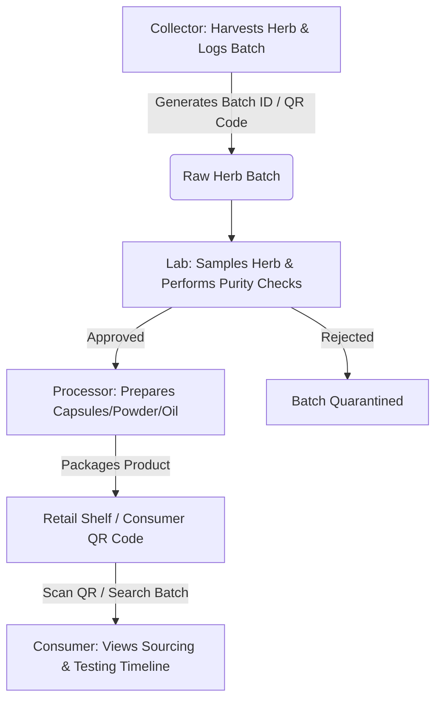

# 🍃 AyurTrace (Frontend Portal)

> A modern, secure, and transparent supply chain tracing platform for Ayurvedic herbs. Ensuring purity, quality, and complete transparency from farm to pharmacy.

---

## 📋 Table of Contents
1. [Overview](#-overview)
2. [Key Features](#-key-features)
3. [Architecture & Workflow](#-architecture--workflow)
4. [Tech Stack](#-tech-stack)
5. [Project Structure](#-project-structure)
6. [Getting Started](#-getting-started)
7. [Screenshots & Design Philosophy](#-screenshots--design-philosophy)

---

## 🌟 Overview

**AyurTrace** is a specialized decentralized-design web application that solves the trust deficit in the sourcing of traditional Ayurvedic herbs. By enabling a verifiable, role-based chain of custody, AyurTrace allows consumers, processors, and laboratories to trace the complete timeline of any herb batch—from the specific forest or farm where it was harvested, through lab testing, processing, packaging, and finally to the retail shelf.

---

## 🚀 Key Features

The application incorporates five distinct, highly interactive dashboards customized for different supply chain roles:

### 1. 🌿 Collector Dashboard
*   **Harvest Logging:** Log wild-harvested or cultivated herb batches with crucial metadata (botanical name, collection date, geographic coordinates/location, quantity).
*   **Batch QR Generation:** Create a unique Batch ID and scannable QR Code dynamically.
*   **History Logs:** View and track previously collected batches and their current status in the supply chain.

### 2. 🧪 Quality Lab Dashboard
*   **Verification & Analysis:** Access pending batches and perform strict quality testing.
*   **Parameters Logged:** Test and log purity levels, active compound concentration (alkaloids/curcuminoids), heavy metals check, and moisture content.
*   **Digital Sign-off:** Certify batches as "Approved" or "Rejected" with official digital logs.

### 3. 🏭 Processor Dashboard
*   **Refinement & Formulation:** Log processing tasks (e.g., drying, grinding, oil extraction).
*   **Product Conversion:** Record the conversion of raw bulk herbs into consumer-packaged products (e.g., Ashwagandha powder, Tulsi capsules, Triphala churn).
*   **Trace Continuation:** Append processing dates, batch mixing info, and target distribution channels.

### 4. 🛍️ Consumer Portal
*   **Interactive Search & QR Scan:** Scan a batch QR code or input a Batch ID using the built-in device camera scanner.
*   **Visual Supply Chain Timeline:** View a beautiful, step-by-step interactive timeline showing:
    1.  *Sourcing Info:* Collector name, date, and location.
    2.  *Purity Certificate:* Lab test results, chemical analysis, and approval status.
    3.  *Processing details:* Facility, packing date, and final product details.

### 5. 👑 Admin Dashboard
*   **System Overview:** Real-time metrics on total batches, registered actors, approved vs. rejected products.
*   **Role Management:** Authorize or revoke credentials for Collectors, Labs, and Processors.
*   **System Audit:** View raw data logs of all operations.

---

## 🔄 Architecture & Workflow



---

## 🛠️ Tech Stack

*   **Framework:** [React 18](https://react.dev/) + [Vite](https://vite.dev/) (Ultra-fast HMR and building)
*   **Styling:** [Tailwind CSS](https://tailwindcss.com/) (Nature-themed palette focusing on deep forest green `#1B2C08` and warm earth brown tones)
*   **Animations:** [Framer Motion](https://www.framer.com/motion/) (Smooth hover effects, page transitions, and micro-animations)
*   **Data Fetching & Caching:** [TanStack Query v5](https://tanstack.com/query/latest)
*   **Routing:** [React Router v6](https://reactrouter.com/en/main)
*   **UI Primitives:** [Shadcn UI](https://ui.shadcn.com/) (Fully accessible components powered by Radix UI)
*   **Icons:** [Lucide React](https://lucide.dev/)
*   **Analytics & Charts:** [Recharts](https://recharts.org/) (Interactive graphs for Lab and Admin metrics)
*   **Form Validation:** [React Hook Form](https://react-hook-form.com/) + [Zod](https://zod.dev/)

---

## 📁 Project Structure

```text
AyurTraceProject/
├── src/
│   ├── assets/          # Static assets (images, logos)
│   ├── components/      # Reusable UI components (Navigation, Footer, UI wrappers)
│   │   └── ui/          # Shadcn primitive components (buttons, cards, dialogs)
│   ├── hooks/           # Custom React hooks
│   ├── lib/             # Utility configurations (Tailwind classes merger)
│   ├── pages/           # Core Role-Based Dashboards & Pages
│   │   ├── AdminDashboard.jsx
│   │   ├── CollectorDashboard.jsx
│   │   ├── ConsumerPortal.jsx
│   │   ├── HomePage.jsx
│   │   ├── LabDashboard.jsx
│   │   ├── LoginPage.jsx
│   │   ├── NotFound.jsx
│   │   ├── ProcessorDashboard.jsx
│   │   └── SignupPage.jsx
│   ├── App.css          # Core custom styles
│   ├── index.css        # Tailwind config & global root styles
│   └── main.jsx         # App mounting point
├── package.json         # Package configuration & dependencies
├── vite.config.ts       # Vite build configurations
└── tailwind.config.js   # Tailwind design tokens & themes
```

---

## ⚙️ Getting Started

### Prerequisites
*   [Node.js](https://nodejs.org/) (v16.0.0 or higher recommended)
*   [npm](https://www.npmjs.com/) or [Bun](https://bun.sh/) package manager

### Steps to Run

1.  **Clone the repository:**
    ```bash
    git clone https://github.com/aakritig1805/AyuTrace
    cd AyuTrace
    ```

2.  **Navigate to the project folder:**
    ```bash
    cd AyurTraceProject
    ```

3.  **Install dependencies:**
    ```bash
    npm install
    # or
    bun install
    ```

4.  **Run local development server:**
    ```bash
    npm run dev
    # or
    bun run dev
    ```

5.  **Open in Browser:**
    Navigate to `http://localhost:5173` to interact with the application.

---

## 🎨 Design Philosophy & UX

AyurTrace was crafted to provide an immersive, nature-inspired user experience. Key design guidelines implemented include:
*   **Curated Nature Color Scheme:** Uses soft herbal greens, warm terracotta accents, and dark natural backgrounds to align visually with Ayurvedic tradition.
*   **Tactile Framer-Motion Interactions:** Cards elevate slightly on hover, and sections dynamically load with gentle fade-and-slide motion profiles to feel fluid and highly premium.
*   **Intuitive Visual Indicators:** System uses green tags for approved items, yellow for pending, and red warnings for rejected batches to maximize data scannability.
